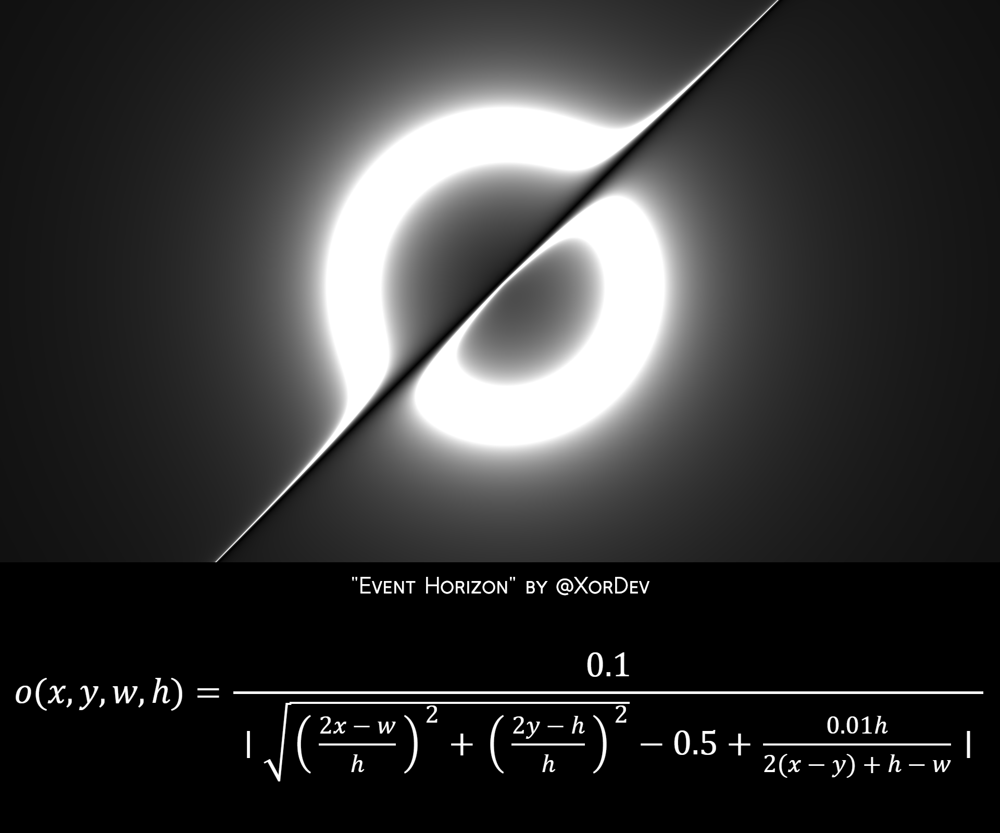

## Event Horizon

It's this thing!

Reference C implementation:
<blockquote class="twitter-tweet">
Huh! That&#39;s cool! <a href="https://t.co/FzvhLtaFu3">https://t.co/FzvhLtaFu3</a> 
&mdash; Тsфdiиg (@tsoding) <a href="https://twitter.com/tsoding/status/1897049953090068614?ref_src=twsrc%5Etfw">March 4, 2025</a></blockquote> 

The terminal one needs to be compiled with `zig build-exe`, and has a simple cli (type `--help` for options)

The raylib one needs to be compiled and run with `zig build run`. Screen size can be altered with the constants at the beginning of the main function
